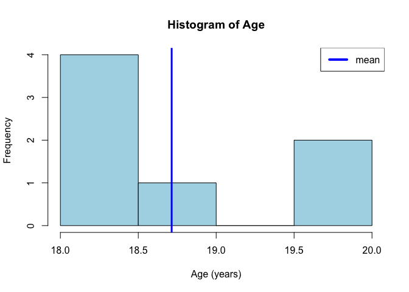
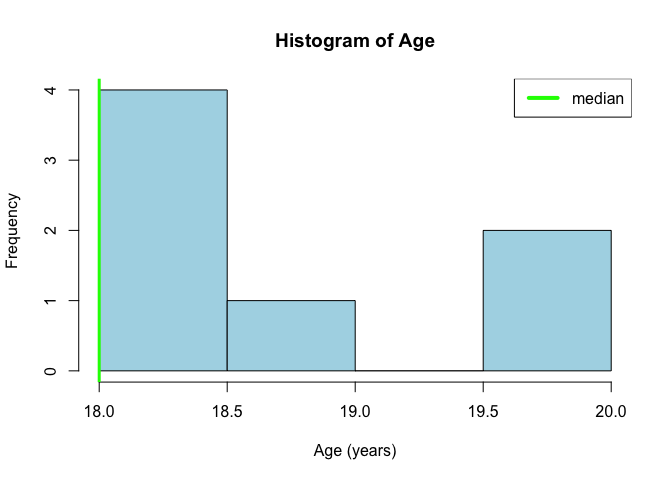
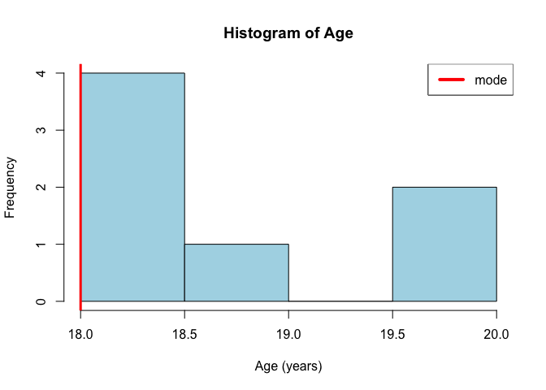

First Moment: Middle
====================

Mean (average)
--------------

### Definition:

The mean *x̄*, *μ* is the point around which the sum of the deviations is
0. The formula is given by
$$ \\bar{x}=\\frac{\\sum\_{i=1}^n x\_i}{n} $$
 where *x*<sub>*i*</sub> is each element and *n* is the number of
elements. In words, add the numbers together and divided by how many
numbers are in the list.

### Example

Given the list of 7 ages at a concert {19,18,20,18,18,18,20}, the mean
is:

$$ \\bar{x}=\\frac{20+18+19+18+18+18+20}{7}=18.71429. $$

In R code:

``` r
Age=c(20, 18,19, 18,18,18,20) # List of 7 numbers
## Cacluate the mean in the long form
(20+18+19+18+18+18+19+20)/7
```

    ## [1] 21.42857

``` r
## Cacluate the mean using the function mean
mean(Age) # The mean of the list
```

    ## [1] 18.71429

### Graphical representation of the mean:

``` r
hist(Age,col="lightblue",xlab="Age (years)") # Histogram of the 7 numbers
abline(v=mean(Age),col="blue",lwd=3)# line indicating the mean
legend("topright",c("mean"),lwd=4,col=c("blue"))
```



### Mean Pros and Cons

Pros of the mean:

-   The mean is easy to calculate.

-   The mean is well known and understood.

Cons of the mean: \* The mean is senstitive to extreme values.

Given the list of the ages of 8 people at a concert {20,18,19, 18,56,
18,18,20}, the mean is:

$$ \\bar{x}=\\frac{20+18+19+18+18+56+18+20}{8}=23.375. $$

In R code:

``` r
Age=c(20,18,19, 18,56, 18,18,20) # List of 8 ages
## Cacluate the mean using the function mean
mean(Age) # The mean of the list
```

    ## [1] 23.375

Median
------

### Definition:

The median is the middle values of an ordered list.

### Example

Given the list of 7 ages at a concert {19,18,20,18,18,18,20}.

1.  First the list has to be ordered {18,18,18,18,19,20,20}.

2.  Then the middle of the list found {18,18,18,*18*,19,20,20}.

The median is 18.

In R code:

``` r
Age=c(20,18,19,18,18,18,20) # List of 7 numbers

median(Age)
```

    ## [1] 18

### Graphical representation of the median:

``` r
hist(Age,col="lightblue",xlab="Age (years)") # Histogram of the 7 numbers
abline(v=median(Age),col="green",lwd=3)# line indicating the median
legend("topright",c("median"),lwd=4,col=c("green"))
```


\#\#\# Median Pros and Cons Pros of the median:

-   The median is the centre of the data - very intuitive.
-   Not as sensitive as the mean to extreme values.

Cons of median: \* The calculation of the median does not use all data.
\* Sorting a long list can be computationally expensive.

Mode
----

### Definition:

The mode is the most commonly occurring value in the distribution.

### Example

Given the list of 7 ages at a concert {19,18,20,18,18,18,20}. The most
frequent values is 18, so 18 in the mode.

### In R code:

``` r
Age=c(20,18,19,18,18,18,20) # List of 7 numbers
# Function to calculate mode
Mode <- function(x) {
  ux <- unique(x)
  ux[which.max(tabulate(match(x, ux)))]
}
Mode(Age)
```

    ## [1] 18

### Graphical representation of the mode:

``` r
hist(Age,col="lightblue",xlab="Age (years)") # Histogram of the 7 numbers
abline(v=Mode(Age),col="red",lwd=3)# line indicating the mode
legend("topright",c("mode"),lwd=4,col=c("red"))
```



### Median Pros and Cons

Pros of the mode:

-   The mode shows where the data is concentrated.

Cons of the mode:

-   More than one Mode in a dataset.
-   The calculation of the mode does not use all the data.
